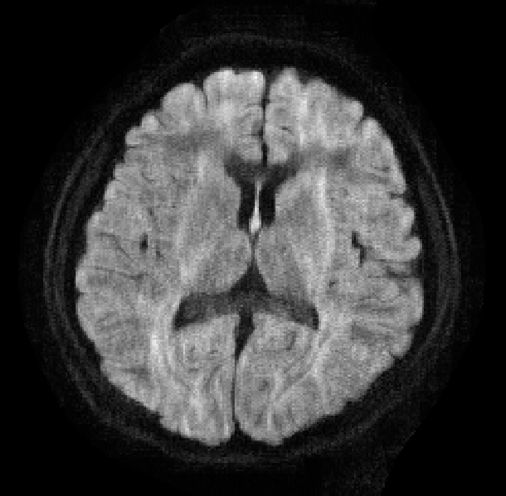

# Weighted nuclear norm minimization (WNNM) for low-rank approximation

Low rankness of image/k-space data has been exploited in many different MRI applications. The weighted nuclear norm, or weighted summation of the eigenvalues of the matrix, can approximate the rank more accurately than the nuclear norm, and may therefore maintain the signal fidelity better while approaching low-rank approximation. 

Here we provide the implementation of WNNM based on [BART (version 0.4.03)](https://mrirecon.github.io/bart/) for MRI reconstruction. This work has been published on [ISMRM 2020]('Hu_2020ISMRM_wLLR.pdf').

## Usage
We have provided a compiled BART (on Mac OS). By running demo_wllr, you should be able to get the following results. 

  

To make it run on you own machine, download BART (version 0.4.03) and replace the scr/lowrank/batchsvd.c file with our provided file. 

## Changes in BART
All the changes are in scr/lowrank/batchsvd.c. BART already implemented the construction of the locally low-rank matrices neatly. All we need to do is to change the weights/regularization parameter for each low-rank matrix and each eigenvalue (line 76 - line 85). This is done based on automatically based on eq.13 in [this paper](https://link.springer.com/article/10.1007/s11263-016-0930-5?utm_source=hybris).

